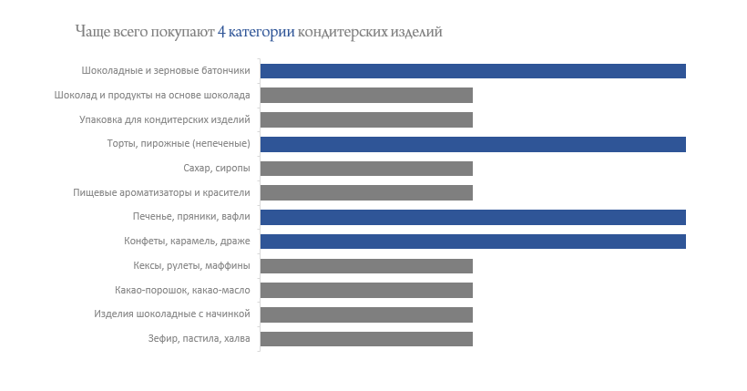
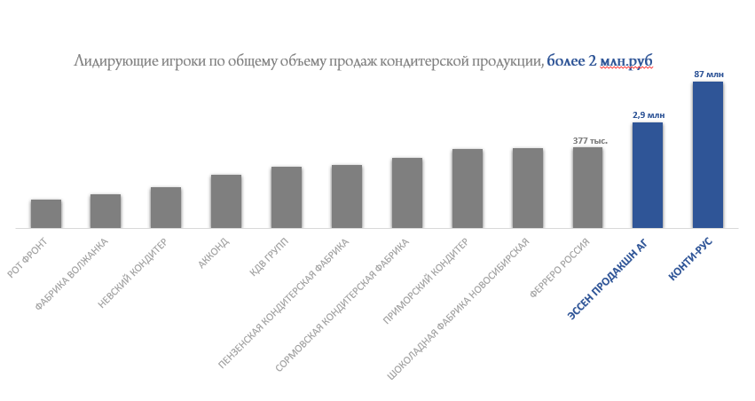
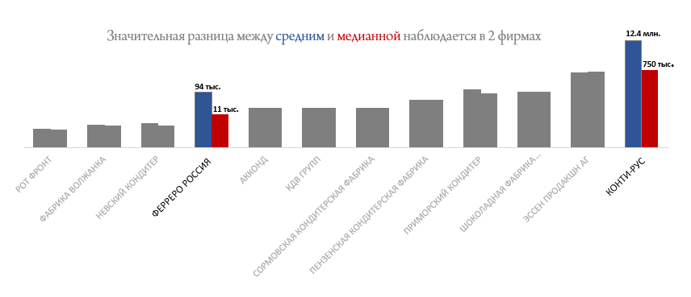
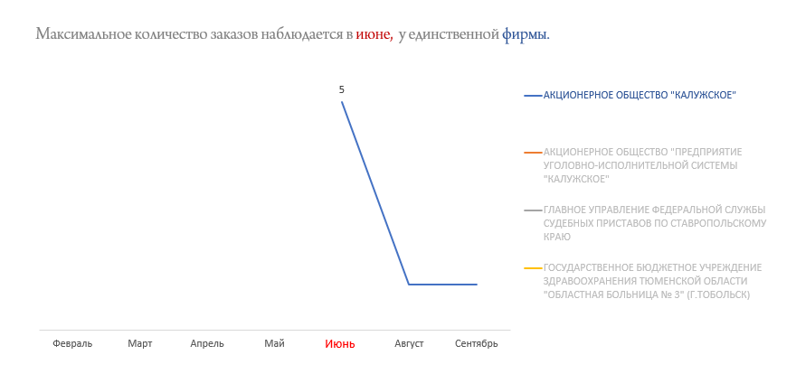

# Анализ государственных контрактов кондитерских компаний

Проект по сбору и анализу данных о государственных и муниципальных закупках кондитерской продукции в России.

## Описание проекта

Проект автоматизирует сбор данных с портала ClearSpending, обрабатывает информацию о контрактах кондитерских компаний и формирует аналитические отчеты.

## Технологический стек

-   **R** (версия 4.2.0+)
-   **Пакеты**:
    -   `httr` - HTTP запросы
    -   `jsonlite` - работа с JSON
    -   `dplyr`, `tidyr` - обработка данных
    -   `stringr` - работа со строками
    -   `openxlsx` - работа с Excel
    -   `purrr` - функциональное программирование

## Источник данных

-   **clearspending.ru**

## Ключевые выводы

### 1. Структура рынка

### 2. Лидеры рынка

### 3. Анализ качества сделок

### 4. Сезонность и ключевые заказчики

### Примечание:

-   Важно отметить, что выборка не является полной
-   Может не включать в себя все сделки по всем компаниям.
-   Таким образом, выводы отражают тренды в рамках имеющихся данных
-   Но могут не претендовать на исчерпывающую полноту картины рынка»
